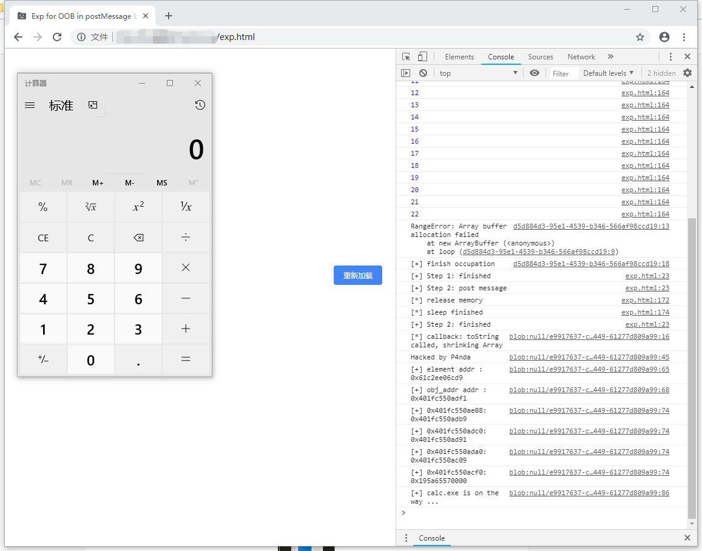

## TianfuCup 2018  —— OOB Write in ValueDeserializer::ReadDenseJSArray

The vulnerability was existed in `postMessage` process, found and exploited by Guang Gong, 360 Alpha Team. I analysis it and rewrite the [exp.html](./exp.html) in Chromium version [70.0.3538.0]( https://commondatastorage.googleapis.com/chromium-browser-snapshots/index.html?prefix=Win_x64/587811/ ).

Because of bad patch , it relates to 3 issues.

 https://bugs.chromium.org/p/chromium/issues/detail?id=905940 

 https://bugs.chromium.org/p/chromium/issues/detail?id=914731 

